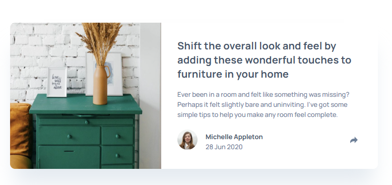
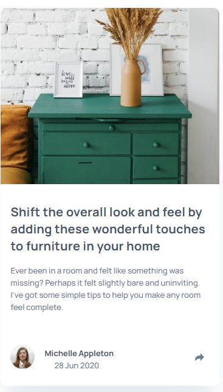

#  Article preview component solution

## Table of contents

- [Overview](#overview)
  - [Screenshot](#screenshot)
  - [Links](#links)
  - [Built with](#built-with)
  - -[Colors Used](#colors-used)

### Screenshot

### Links

- [Solution URL]: (https://your-solution-url.com)
- [Live Site URL]: (https://your-live-site-url.com)

### Built with

- Semantic HTML5 markup
- CSS custom properties
- Flexbox

### Colors used

    --very-dark-gray-blue: #48556A;
    --desaturated-dark-blue: #6D7F97;
    --grayish-blue: #9EAFBF;
    --background-color: var(--background-color);
  

